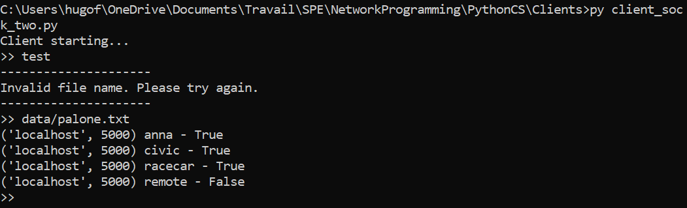

### Hugo Frangiamone - Lisa Bourlier
### 2019-09-17

## Network programming
# Challenge 2

## Introduction
This is the second challenge of the PythonClientServer course. The goal of this challenge is to create a simple TCP server and client. The server will listen for incoming connections and the client will connect to the server. The client will send a sequence of string data and the server will process those string and return whether or not the string is a palindrome.

## Requirements
- The server must be able to handle multiple clients at the same time.
- The server must detect and return palindrome strings.

## Solutions
### Client get data from files
The client will get the data from a file. The file must contain one string per line. The following code shows how to do this:
```python
try:
        flux = open(filename, 'r')
        # read all lines of the file
        lines = flux.readlines()
        # close the file
        flux.close()

        for line in lines:
            msg = line.rstrip()
            client_socket.send(msg.encode())
            sys.stdout.write(client_socket.recv(1024).decode())
    
    except:
        sys.stdout.write('---------------------\n' + 'Invalid file name. Please try again.\n' + '---------------------\n')
```

### Process client's request
The server will process the client's request. The following code shows how to do this:
```python
def process(data):
    data = data.lower().replace(' ', '')
    return data == data[::-1]
```
```python
res = process(str(data))
sock.send(str.encode(str(server_address) + ' ' + str(data) + ' - ' + str(res) + '\n'))
```
Then the server store the result in a file.
```python
f = open('data/' + str(client_address[0]) + '_' + str(client_address[1]) + '_result.txt', 'a')
f.write(str(str(data) + ' - ' + str(res) + '\n'))
f.close()
```

## Usage
The client ask for the file name. 
The server will process the client's request and return the result.
